# 👨💻 Protocol Architecture

### How Data Flows

Players may take positions by selecting a number of variables and depositing collateral. New positions are represented as ERC-721 tokens (Mimics).&#x20;

### Mimics as NFTs

Each minted Mimic will contain specialized metadata written to the blockchain. When rendered within a wallet, that data, along with real-time performance information, will be visible in the NFT itself. Some of the data recorded will include:

* The type of ERC-20 collateral deposited, including contract address
* The amount of deposited collateral
* The NFT collection to peg value against, including contract address
* The direction of the price peg (standard or inverse)
* The collateralization ratio
* The time that the position was opened
* The percentage-based gains or losses, relative to USD, if the position were to close right now&#x20;

      

For the purposes of illustration, we imagine combining the Uniswap v3 LP token design with a posterize filter applied to a randomly selected asset from whatever collection happens to be pegged by the metadata.&#x20;

### **Minting Mimics**

A $MIME holder can mint USDm by locking their $MIME as collateral via the Mimicry smart contract. The steps involved when a $MIME holder mints are:

* The Mimicry contract checks that the $MIME depositor can mint Mimics against their $MIME, which requires their Collateralization Ratio to be below 800%.
* Their debt is added to the Debt Register. The debt is the amount of the new value minted, and is stored in USDm
* With the debt assigned to the depositor, the Mimicry contract instructs the USDm contract to issue the new amount. It adds it to its total supply and assigns the newly minted USDm to the user’s wallet.

If the price of $MIME increases, an equivalent portion of a depositor's $MIME is automatically unlocked as collateral. For example, if a user locks $100 of $MIME as collateral, and the value of $MIME doubles, then half of their $MIME (total value: $200) is locked and the other half is unlocked. If they wish, that extra unlocked $MIME can then be deposited to mint more USDm, or any other asset that has a Mimic contract.

### **Exchanges**

The steps involved for the smart contracts to process a Mimic exchange (from USDm to BAYCm in this example) are below:

* Burn the source Mimic (USDm), which involves reducing that wallet address’s USDm balance and updating the total supply of USDm.
* Establish the conversion amount (i.e. the exchange rate, based on the floor price of the BAYC collection).
* Charge an exchange fee, which is currently 0.25% of the converted amount, and send the fee as USDm to the fee pool, where it can be claimed by $MIME depositors.
* The remaining 99.75% is issued by the destination Mimic (BAYCm) contract and the wallet address balance is updated.
* The BAYCm total supply is updated.

No counterparty is required to exchange, as the system converts the debt from one Mimic to another. Hence no order books or order matching is required, resulting in infinite liquidity between Mimics. No debt change is required to be recorded against the debt pool either, as the same value is burned from the source Mimic and minted from the destination Mimic.

### **Claiming Fees**

When Mimics are exchanged through the Mimicry contract, a 0.25% fee is extracted and sent to the fee pool to be claimed by MIMIC depositors. When claiming fees, a depositor also claims their $MIME depositing rewards, which reward them with extra $MIME for depositing the $MIME they currently have. The smart contracts' process once a depositor requests to claim their fees is as follows:

* The fee pool checks whether there are fees currently available and whether the depositor is eligible to receive fees.
* The amount of fees in USDm is sent to the depositor's wallet address and the balance of the fee pool is updated.
* Additionally, a pro-rata amount of escrowed $MIME is assigned to the wallet address from the $MIME depositor rewards contract.

Fees are allocated based on the proportion of debt each depositor has issued. For example, if a depositor has issued 1,000 USDm in debt, the debt pool is 10,000 USDm, and 100 USDm in fees are generated in a fee period, this depositor is entitled to 10 USDm because their debt represents 10% of the debt pool. The same proportional distribution mechanism is used for $MIME depositor rewards.

### **Burning Debt**

When a $MIME depositor wants to exit the system or reduce their debt and unlock deposited $MIME, they must pay back their debt. At its simplest: a depositor mints 10 USDm by locking $MIME as collateral, and must burn 10 USDm to unlock it. But if the debt pool fluctuates (and therefore their individual debt fluctuates) while they are deposited, they may need to burn more or less debt than they minted. The process for reducing debt to zero is as follows:

* The Mimicry contract determines their debt balance and removes them from the Debt Register.
* The required amount of USDm is burned, and total supply of USDm is updated along with the USDm balance in the user’s wallet.
* Their $MIME balance becomes transferrable.

### **The Debt Pool**

The system tracks the debt pool (as well as each individual depositor's debt) each time a $MIME holder mints or burns Mimics. It does this by updating the Cumulative Debt Delta Ratio. This measures the $MIME depositor’s proportion of the debt pool at the time they last minted or burned, as well as the debt change caused by other depositors entering or leaving the system. The system uses this information to determine the individual debt of each depositor at any time in the future, without having to actually record the changing debt of each individual depositor.

Updating the Cumulative Debt Delta Ratio on the Debt Register allows the system to track every user’s % of the debt. It calculates the % change the new debt introduces against the debt pool using the formula below and appends it to the Debt Register:

`New Debt Minted (Total Existing Debt + New Debt)`

The depositor's last mint/burn action is then recorded in the Debt Register within their issuance data and the relative index number at which this action happened. The detail recorded is the percentage of the debt pool they represent, which is calculated by this formula:

`User debt percentage == (New Debt + Existing Debt) (Previous Debt Pool + New Debt)`

The Debt Register holds the Cumulative Debt Delta Ratio, which is the product of the calculation above, and the relative time (index) the debt was added, so that it can be used to calculate any user’s % of the debt pool at any index in the future based on the % shift in the debt pool their last mint/burn caused.

The debt pool is recalculated by summing the number of tokens in each Mimic contract multiplied by the current exchange rates, each time new debt is issued/burned:

`totalDebtIssued == totalIssuedMimics`

This enables the calculation of the current debt pool, and is included in the updated Cumulative Debt Delta Ratio so that we know at each Debt Register entry the size of the debt (in Mimics).

When a depositor pays back their debt (i.e. by burning the Mimics they minted) to unlock their $MIME collateral the system updates the Cumulative Debt Delta based on the % shift in the amount of debt to be burned against the total value of the system’s debt after the reduction in debt.

This is the inverse calculation from when a user mints new debt:

`user's new debt percentage == (existing debt - debt to be burned) (debt pool - debt to be burned)`

This is the formula for calculating the updated Cumulative Debt Delta:

`delta == debt to be burned (debt pool - debt to be burned)`

If a depositor burns all their debt, their issuance data in the Debt Register will be set to 0 and they will no longer be part of the debt pool.

### **The Oracle**

The value of all mimic assets in the Mimicry protocol are currently determined by oracles that push price feeds on-chain. It uses an algorithm with a variety of sources to form an aggregate value for each asset. The price feeds are currently supplied by both Chainlink’s independent node operators and Mimicry, and eventually will be entirely supplied by a decentralized oracle such as Chainlink.
